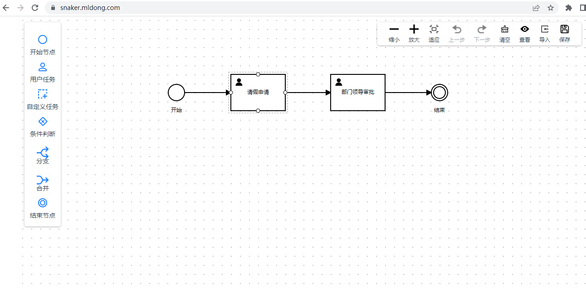
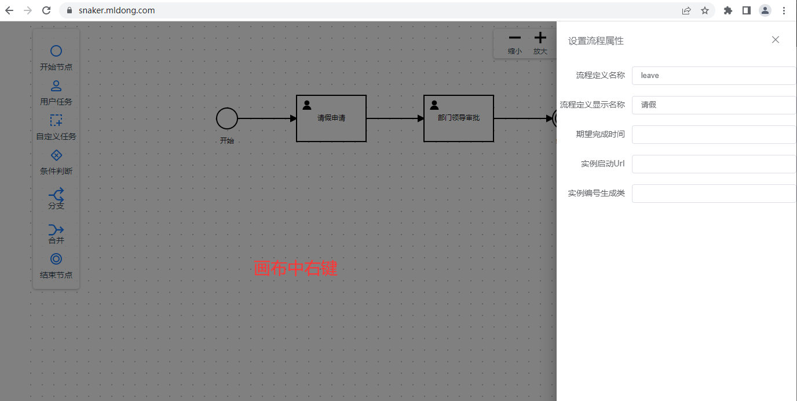
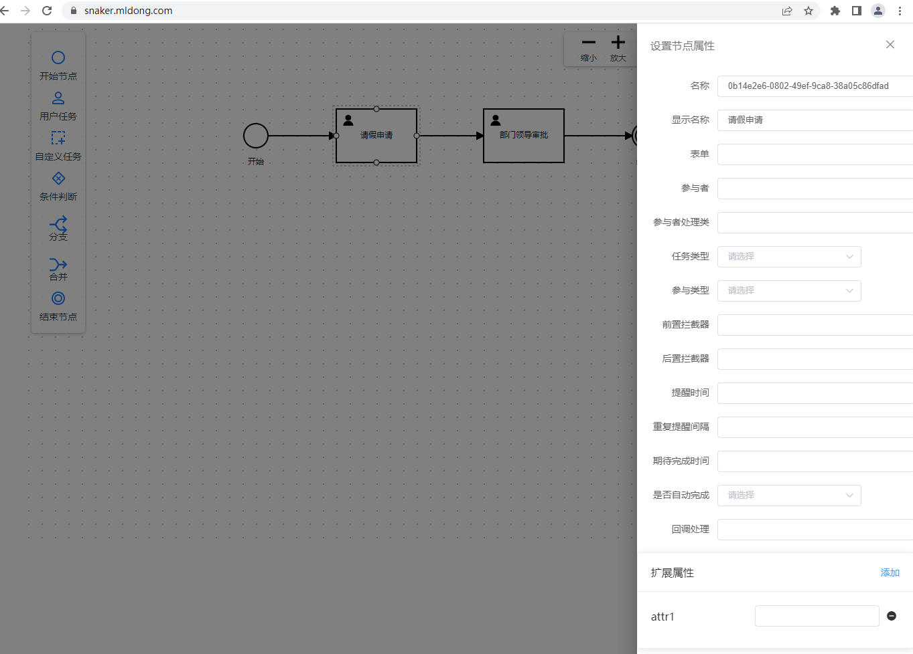
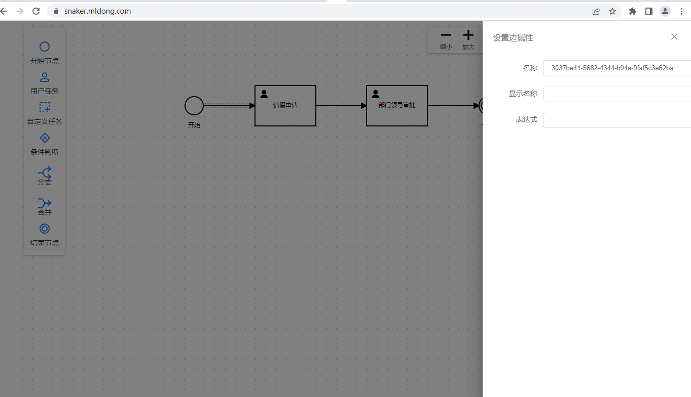
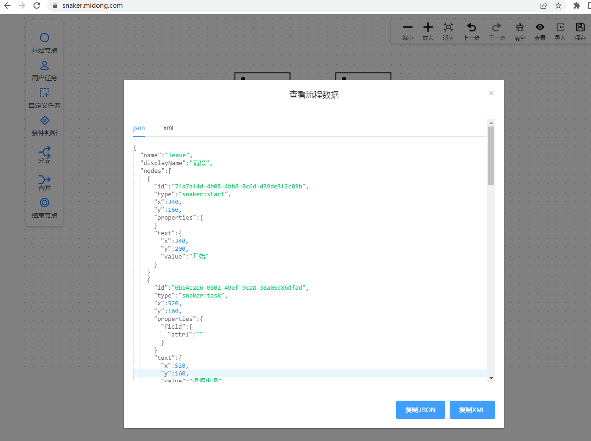
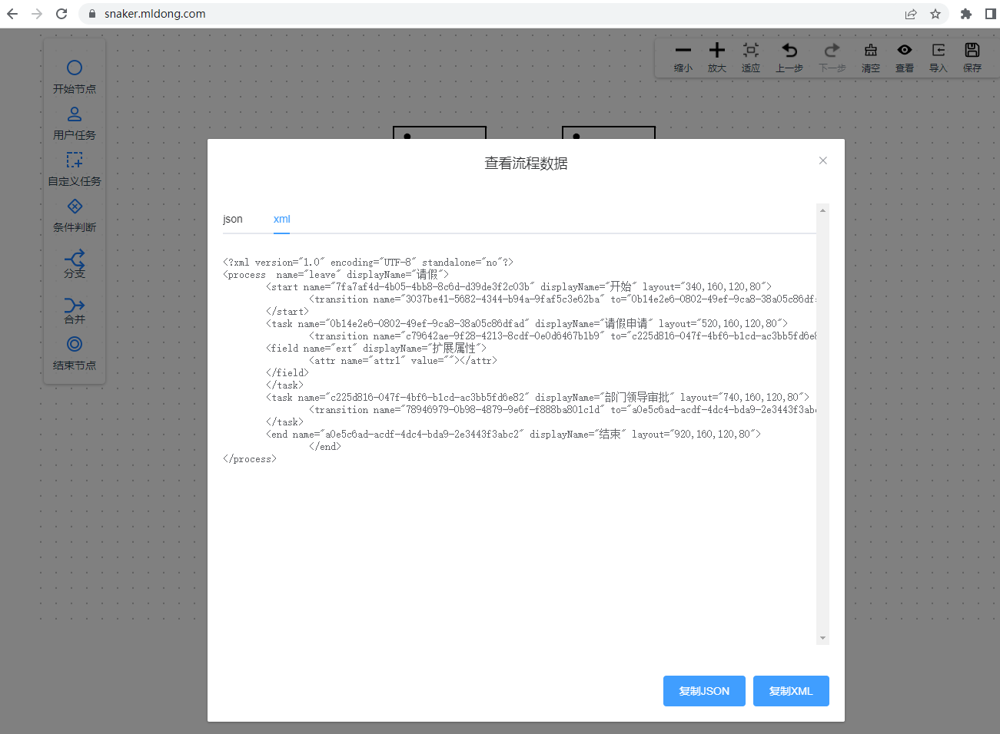
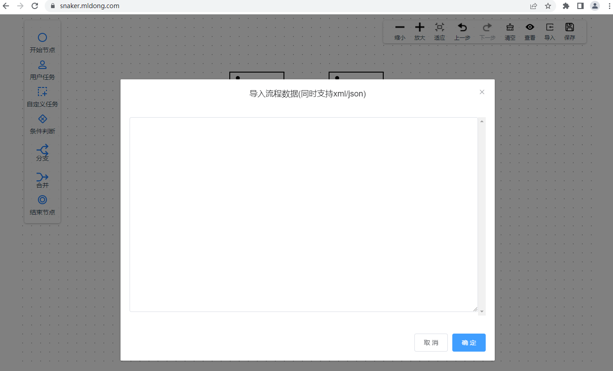

# snaker工作流引擎web设计器
[在线体验] (https://snaker.mldong.com/)
## 安装
```
npm install
```

## 开发
```
npm run serve
```

## 打包编译
```
npm run build
```

## 校验
```
npm run lint
```

## 截图














## 相关资料
[LogicFlow] (http://logic-flow.org/)

[snaker工作流中文文档] (https://yunmel.gitbooks.io/snakerflow/content/)

[snaker源码] (https://gitee.com/mthird-party/snakerflow)